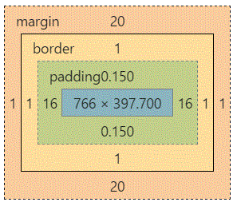

# Preguntas para entrevista de frontend
## CSS
### Preguntas

1. [x] [¿Cuál es la diferencia entre selectores de ID o CSS?](#1)
1. [x] [¿Cuál es la diferencia entre "resetear" y "normalizar" el CSS (reset.css y normalize.css)? ¿Cuándo elegirias uno u otro?](#2)
1. [x] [Describe la propiedad "float" y como funciona](#3)
1. [ ] [¿Cómo funciona el z-index y el context stacking (contexto de apilamiento) de elementos está formado?](#4)
1. [ ] [¿Conoces alguna "técnicas de limpieza" de estilos (clearing techniques)?](#6)
1. [x] [Como funcionas los sprites de CSS, y como lo podrías implementar?](#7)
1. [ ] [¿Cuál sería tu approach para solucionar problemas con un browser específico?](#9)
1. [x] [¿Cómo desarrollas sitios para features específicas por navegadores?](#10)
1. [ ] [¿Cómo visualizas o ocultas visualemente el contenido (o habilitas la visualización solo para sceenreaders)?](#12)
1. [x] [¿Has usado un sistema de grid? ¿Cuáles prefieres y porqué?](#13)
1. [x] [¿Has usado media-queries? ¿Para qué?](#14)
1. [ ] [¿Has usado o estilado SVG? ¿En que situaciones?](#15)
1. [ ] [¿Cómo optimizas tu sitio para imprimir?](#16)
1. [ ] [¿Cuáles son algunos de los "detalles" para escribir CSS eficiente?](#17)
1. [ ] [¿Cuáles son las ventajas/desventajas de usar preprocesadores de CSS?](#18)
1. [ ] [De los preprocesadores que has usado ¿Cuál prefieres y porqué?](#19)
1. [ ] [¿Cómo implementarías una web que usa fuentes no standar?](#20)
1. [x] [¿Sabes cómo un browser determina que elementos emparejar con que reglas de CSS?](#21)
1. [ ] [¿Qué son los pseudo-elementos, para que sirven, dónde y cómo se utilizan?](#22)
1. [x] [Explica el modelo de cajas.](#23)
1. [ ] [¿Qué hace: `* { box-sizing: border-box; }`? ¿Cuáles son sus ventajas?](#24)
1. [ ] [¿Qué valores existen para "display"?](#25)
1. [x] [¿Cuál es la diferencia entre `inline` and `inline-block`?](#26)
1. [ ] [¿Cuál es la diferencia entre `relative`, `fixed`, `absolute` y `static` al definir la posición de un elemento?](#27)
1. [x] [La 'C' en CSS quiere decir 'Cascading'. Como el browser define la prioridad al asignar estilos? ¿Cómo se puede sacar ventaja de esto?](#28)
1. [ ] [¿Qué frameworks de CSS has usado localmente, en producción? ¿Cómo los mejorarías?](#29)
1. [x] [¿Has usado Flexbox o Grid? ¿Qué puedes decirme de ellos?](#30)
1. [ ] [¿Cómo es el diseño `reponsivo` distinto del diseño `adaptable`?](#31)
1. [ ] [¿Hay alguna razón por la que usarías `translate()` por sobre `positon: absolute` positioning, (o viceversa?](#33)
1. [ ] [¿Qué puedes contarme de postCSS?](#34)
1. [ ] [¿Qué puedes contarme de cssNext?](#35)
1. [ ] [¿Cómo el CSS afecta al `critical-render-path`? (El proceso de "carga, analisis y renderizado" de un sitio web)](#36)

### Respuestas


- #### [¿Cuál es la diferencia entre selectores de ID o CSS?](#1)
  <div id="1" />
  - La primera diferencia es en sintaxis, tanto al definirlos en el HTML como en el CSS.
    ```html
    <div id="hola"/>
    <div class="hola mundo"/>
    ```
    ```css
    #hola { }
    .hola { }
    .mundo { }
    ```

  - Un elemento puede tener solo 1 ID, pero múltiples clases.
  - Dentro de un DOM, los ID's son únicos, pero las clases pueden repetirse entre elementos
  - Los ID's funcionan como identificador único para scrollear una web.
    - Al entrar a `http://www.ejemplo.com#hola_mundo` el navegador reconocerá el hash value `hola_mundo` e intentará encontrar el elemento con ID `hola_mundo` y scrollear el sitio hasta él.
  - Al estilar, los ID's tienen precedencia sobre las clases.

- #### [¿Cuál es la diferencia entre "resetear" y "normalizar" el CSS (reset.css y normalize.css)? ¿Cuándo elegirias uno u otro?](#2)
  <div id="2" />
  - Al *resetear* el css (`reset.css`) se busca remover todo el estilado por defecto que los browsers realizan a un DOM, mientras que al *normalizarlo* (`normalize.css`) busca generar un estilo consistente a lo largo de todos los navegadores.


- #### [Describe la propiedad "float" y como funciona. Hay alguna alternativa?](#3)
  <div id="3" />
- La propiedad "float" sirve para flotar un elemento, de la cual acepta 3 argumentos, que pueden ser: izquierda (left), derecha (right) o ninguno (none), de está forma, se puede situar un contenedor o elemento al lado que deseas.

- La alternativa para el caso de un menu con listas, podría ser inline-block.


- #### [¿Cómo funciona el z-index y el context stacking (contexto de apilamiento) de elementos está formado?](#4)
  <div id="4" />


- #### [¿Conoces alguna "técnicas de limpieza" de estilos (clearing techniques)?](#6)
  <div id="6" />


- #### [Como funcionas los sprites de CSS, y como lo podrías implementar?](#7)
  <div id="7" />
Los sprites en CSS hace referencia a una imagen que puede servir para muchas situaciones, para implementarlas se puede llamar tanto a la propiedad background-image con background-position por separado, como llamar directamente a la propiedad background implementada directamente.


- #### [¿Cuál sería tu approach para solucionar problemas con un browser específico?](#9)
  <div id="9" />


- #### [¿Cómo desarrollas sitios para features específicas por navegadores?](#10)
  <div id="10" />
  ** Pregunta Abierta **
  Algunas solucuiones pueden ser:
    - Uso de frameworks de css para facilitar la homogeneidad.
    - Preprocesadores de CSS
    - Post-procesado del CSS al realizar el build del sito.
      - Gulp / Grunt / Webpack
      - PostCSS


- #### [¿Cómo visualizas o ocultas visualemente el contenido (o habilitas la visualización solo para sceenreaders)?](#12)
  <div id="12" />


- #### [¿Has usado un sistema de grid? ¿Cuáles prefieres y porqué?](#13)
  <div id="13" />
Sí, he ocupado son Semantic y Bootstrap 3 y 4. Personalmente, prefiero Bootstrap por el fácil manejo de grillas y como uno encuentra todo mejor documentado, aparte, es super simple y util de ocupar.


- #### [¿Has usado media-queries? ¿Para qué?](#14)
  <div id="14" />
  Sí, para hacer un diseño adaptable, que a diferencia del responsivo, este último ocupa unidades de tamaño fijo conjunto a media queries. El diseño adaptable, ocupa unidades de medidas relativas.


- #### [¿Has usado o estilado SVG? ¿En que situaciones?](#15)
  <div id="15" />


- #### [¿Cómo optimizas tu sitio para imprimir?](#16)
  <div id="16" />


- #### [¿Cuáles son algunos de los "detalles" para escribir CSS eficiente?](#17)
  <div id="17" />


- #### [¿Cuáles son las ventajas/desventajas de usar preprocesadores de CSS?](#18)
  <div id="18" />


- #### [De los preprocesadores que has usado ¿Cuál prefieres y porqué?](#19)
  <div id="19" />


- #### [¿Cómo implementarías una web que usa fuentes no standar?](#20)
  <div id="20" />


- #### [¿Sabes cómo un browser determina que elementos emparejar con que reglas de CSS? (Especificidad de selectores)](#21)
  <div id="21" />

  Imaginemos un array de 4 espacios en 0 `[0,0,0,0]` donde las reglas de CSS para un elemento se analizan así:

  - Por cada selector de **tag** o **pseudo selector** `*, li, :nth-child(), :nth-of-type()`, se le suma 1 a la cuarta (4ta) posición
  - Por cada **clase** o **pseudo clase** se le suma 1 a la tercera (3era) posición.
  - Por cada **ID** se le suma 1 a la segunda (2da) posición.
  - Por un **atributo "style"** en el css, se le suma a la primera (1era) posición,


  ```CSS
  *             {}  /* especificidad = 0,0,0,0 */
  li            {}  /* especificidad = 0,0,0,1 */
  li:first-line {}  /* especificidad = 0,0,0,2 */
  ul li         {}  /* especificidad = 0,0,0,2 */
  ul ol+li      {}  /* especificidad = 0,0,0,3 */
  h1 + *[rel=up]{}  /* especificidad = 0,0,1,1 */
  ul ol li.red  {}  /* especificidad = 0,0,1,3 */
  li.red.level  {}  /* especificidad = 0,0,2,1 */
  #x34y         {}  /* especificidad = 0,1,0,0 */
  #x34y #press  {}  /* especificidad = 0,2,0,0 */
  style=""          /* especificidad = 1,0,0,0 */
  ```

 Luego de adjuntar todos los estilos necesarios a un elemento, se adjuntan los estilos de menor prioridad a mayor, y se sobre-escriben, por ejemplo:

   ```html
   <html>
    <head>
      <style>
        p {
          color: red;
        }
        #mi_id {
          color: grey;
        }
      </style>
    </head>
    <body>
      <p id="mi_id" style="color: blue"> </p>
    </body>
  </html>
  ```
  En este caso la especificidad sería:

  ```CSS
  p             {}  /* especificidad = 0,0,0,1 */
  #mi_id        {}  /* especificidad = 0,1,0,0 */
  style=""          /* especificidad = 1,0,0,0 */
  ```
  Finalmente, el color del contenido de `<p id="mi_id" style="color: blue"> </p>` es azul.

  - OJO: `!important`, toma precedencia por sobre otras reglas del mismo nivel solamente.
  - Adicional, al haber 2 reglas con la misma especificidad, el navegador selecciona la últma regla definida (la "más reciente").


- #### [¿Qué son los pseudo-elementos, para que sirven, dónde y cómo se utilizan?](#22)
  <div id="22" />


- #### [Explica el modelo de cajas.](#23)
  <div id="23" />

  
  
  La propiedad padding hace referencía al espacio que está dentro del contenedor o caja, a diferencia de la propiedad margin que está relacionado al espacio que está fuera del contenedor. Pueden ser en cuatros posiciones (top, bottom, left, right) y de diferentes medidas de acuerdo a lo necesitado.
  
  En cuanto a la propiedad border, hace referencia al contorno del contenedor, como la traducción literal lo menciona, es un borde como tal.
  
  Básicamente, la diferencia está en el espacio que se otorga, mientras que Padding separá desde adentro hacía afuera del contenedor, border da el contorno y finalmente margin separá hacía afuera del contenedor.


- #### [¿Qué hace: `* { box-sizing: border-box; }`? ¿Cuáles son sus ventajas?](#24)
  <div id="24" />


- #### [¿Qué valores existen para "display"?](#25)
  <div id="25" />


- #### [¿Cuál es la diferencia entre `inline` and `inline-block`?](#26)
  <div id="26" />
  
  La diferencia entre la propiedad "inline" e "inline-block" es que la propiedad inline-block puede afectar a otras directamente, ya que está ultima no tiene un largo y ancho definido que no pueda afectar a las demás.
  
  Ejemplo practico: http://jsfiddle.net/Mta2b/


- #### [¿Cuál es la diferencia entre `relative`, `fixed`, `absolute` y `static` al definir la posición de un elemento?](#27)
  <div id="27" />


- #### [La 'C' en CSS quiere decir 'Cascading'. Como el browser define la prioridad al asignar estilos? ¿Cómo se puede sacar ventaja de esto?](#28)
  <div id="28" />

  - Relacionado a la [pregunta 21](#21).

  - Una de las ventajas de que las definiciones sean en "cascada" es la posibilidad de encapsular comportamientos y estilos.
    Gracias a esto es posible usar CSS para definir características superiores y específicas:
    Por ejemplo:
    ```css
    .link {
      font-size: 1.3em;
    }
    .link:hover {
      font-size: 1.5em;
    }
    .mainArea .link {
      background-color: red;
    }

    .sideBar .link {
      background-color: blue;
    }

    .sideBar .social .link {
      background-color: teal;
    }
    ```
    Gracias a esta definicion es posible tener en nuestra página, 3 tipos de links con un estilo y funcionalidad en común `font-size` y con estilos diferentes dependiendo del area en el que se encuentren.


- #### [¿Qué frameworks de CSS has usado localmente, en producción? ¿Cómo los mejorarías?](#29)
  <div id="29" />
  - ** Pregunta Abierta **


- #### [¿Has usado Flexbox o Grid? ¿Qué puedes decirme de ellos?](#30)
  <div id="30" />
  - [FlexBox](https://css-tricks.com/snippets/css/a-guide-to-flexbox/) y [Grid](https://css-tricks.com/snippets/css/complete-guide-grid/) son 2 módulos de CSS creados para diseñar interfaces en la web.

  - Flexbox permite que los elementos se comporten de manera mucho más predecible en diferentes tamaños de pantalla, lo que facilita el diseño de interfaces responsivas.

  - Grid Layout viene siendo la estandarizción de los sistemas de grillas existentes actualmente (boostrap, grid.css, etc).
    Actualemte es un **working draft**, por lo que no está soportado en producción y su api puede cambiar.


- #### [¿Cómo es el diseño `responsivo` distinto del diseño `adaptable`?](#31)
  <div id="31" />


- #### [¿Hay alguna razón por la que usarías `translate()` por sobre `positon: absolute` positioning, (o viceversa?](#33)
  <div id="33" />


- #### [¿Qué puedes contarme de postCSS?](#34)
  <div id="34" />


- #### [¿Qué puedes contarme de cssNext?](#35)
  <div id="35" />


- #### [¿Cómo el CSS afecta al `critical-render-path`? (El proceso de "carga, analisis y renderizado" de un sitio web)](#36)
  <div id="36" />
