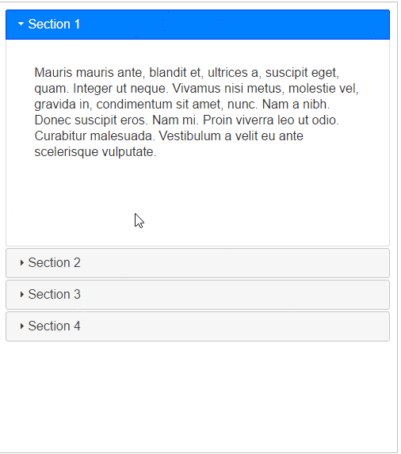
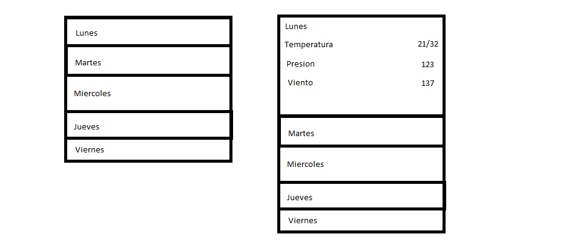

Puesto: Front End Engineer.
### Preguntas
1. [ ] Existe un div#main con 2 sub-divs(#div1, #div2) exactamente iguales en estructura.
  ```html
  <div id="main">
    <div id="div1">
      <p></p>
      <p></p>
      <p>
        <div></div>
        <div>
          <a href="#">
            <span id="mi-span"></span>
          </a>
        </div>
      </p>
      <p></p>
    </div>
    <div id="div1">
      <p></p>
      <p></p>
      <p>
        <div></div>
        <div>
          <a href="#">
            <span id="mi-otro-span"></span>
          </a>
        </div>
      </p>
      <p></p>
    </div>
  </div>
  ```

  Crea una función (O varias) que encuentre si la posición de `span#mi-otro-span` coincide con la posición de `span#mi-span` en sus respectivos "sub-dom".

  Extensiones:
    -  Que pasa si agrego 2 divs en cualquier parte del `div#2`, como modifico las función para que me alerten de incosistencias en el Dom?
    - Recursividad
      - (Si usó recursividad): Puedes eliminar la recursividad?
      - (Si no usó recursividad): Puedes volverlo recursiva?
      - Que ventajas hay entre una u otra?
    - ¿Cómo puedo hacerlo mejorar su performance?

  ------

1. [ ] Con el siguiente Objeto btenido desde una API:
  ```javascript
  {
    data: [{
      día: 'Lunes',
      temp: {
        max: 29,
        min: 12,
      },
      presion: '128',
      viento: '110'
    }, {
      día: 'Martes',
      temp: {
        max: 29,
        min: 12,
      },
      presion: '128',
      viento: '110'
    }, {
      día: 'Miercoles',
      temp: {
        max: 29,
        min: 12,
      },
      presion: '128',
      viento: '110'
    }, { ... }]
    city: "Santiago"
  }
  ```


  Puedes crear un acordeon (la funcionalidad del gif)?
  


  Con el siguiente formato?
  

  Extensiones:
  - Puedes volverlo responsive?
  - (Si usó floats) Puedes no usar Floats?
  - (Si usó flex) Puedes no usar Flex?
  - ¿Cómo puedo hacerlo mejorar su performance?

  ------

1. [ ] Crea una función que memoize cualquier función:
  ```javascript
  funcionAMemoizar(par1, par2, par3); // calcula 6;

  var memoizada = memoizador(funcionAMemoizar);

  memoizada(par1, par2, par3); // calcula 6
  memoizada(par1, par2, par3); // devuelve 6, pero desde la caché (Ya memoizada, no lo calcula)
  ```

  ------
1. [ ] Queremos crear el siguiente widget.


En donde un cliente pueda agregarlo a su sitio mediante un script en el header:
```html
<head>
  <script src="{WIDGET_URL}" charset="utf-8"></script>
</head>
```
En donde `{WIDGET_URL}` es la URL del script que cargará el widget en el sitio del cliente:

1. Como debería ser esa URL?
1. Qué tipo de consideraciones deberíamos tener al proveer esta funcionalidad al cliente?
1. Escribe el script que genera dicho widget?
1. Como podemos optimizar el script para performance?
1. Que podemos hacer para optimizar para navegadores nuevos y viejos por separado?
1. Debería ser responsive? Adaptable? Estático?


### Respuestas

-----
