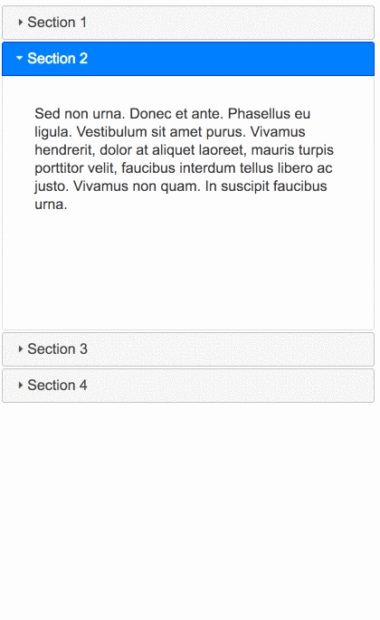

# Preguntas para entrevista de frontend
## Generales

*** Este set de preguntas generales considera preguntas abiertas a propósito. ***
*** Busca generar una conversación, más que escuchar al entrevistado dar una respuesta unitaria o exacta ***
*** La idea es que con estas preguntas pueda el entrevistado expresarse y mostrar su conocimiento de una manera relajada y con menos presión ***

### Preguntas
1. [ ] [¿Qué es lo que más te gusta de codear / programar?](#1)
1. [ ] [¿Cuál fue el último desafío técnico que tuviste?](#2)
1. [ ] [¿Cuál ha sido el desafío tecnológico mas grande que has enfrentado?](#3)
1. [x] [¿Qué consideraciones tendrías que tener para hacer para que tu sitio web tenga mejor rendimiento?](#4)
1. [ ] [¿Qué consideraciones de Seguridad, SEO, Performace, UI, UX, Tecnología, Mantenibilidad y Tamaño debes tener para hacer una webapp?](#5)
1. [ ] [¿Cómo debugueas tu webapp?](#6)
1. [ ] [¿Qué aprendiste esta semana?](#7)
1. [ ] [¿Cuál es tu stack de desarrollo actual?](#8)
1. [ ] [¿Cuál es tu stack de desarrollo preferido?](#9)
1. [ ] [¿Si tuvieras 4 hojas de estilo que tu sitio usa, como las integrarías a tu sitio?](#10)
1. [ ] [Tu sitio está funcionando lento, ¿Cómo lo arreglas?](#11)
1. [ ] [¿Cómo optimizarías los assets de un sitio web? (CSS / JS).](#12)
1. [ ] [Nombra 3 maneras de disminuir el tiempo de carga de un sitio web (Tiempo de carga real o el percibido por el usuario).](#13)
1. [ ] [¿Cómo crearías un slideshow / carrusel de imágenes?](#14)
1. [ ] [Llegas a tu nuevo trabajo, todo el codebas usa tabs pero tu usas espacios. ¿Qué haces?](#15)
1. [ ] [¿Qué es el FOUC? (`Flash of unstyled content` o `Flash de Contenido sin Estilar`).](#16)
1. [ ] [¿Qué es `ARIA` y `Screen Readers`?.](#17)
1. [ ] [¿Cómo haces un sitio web accesible?.](#18)
1. [ ] [¿Cuáles son los pros y contras de usar animaciones de CSS vs animacioens de JavaScript?.](#19)
1. [ ] [¿Qué es CORS?.](#20)
1. [ ] [¿Puedes escribir el código html/css y JS que resulte en lo siguiente?.](#21)
  - 

### Respuestas
1. [¿Qué es lo que más te gusta de codear / programar?](#1)
    

    ** Pregunta personal, la idea es con esto generar una conversación **

1. [¿Cuál fue el último desafío técnico que tuviste?](#2)
    

    ** Pregunta personal, la idea es con esto generar una conversación **

1. [¿Cuál ha sido el desafío tecnológico más grande que has enfrentado?](#3)
    

    ** Pregunta personal, la idea es con esto generar una conversación **

1. [¿Qué consideraciones tendrías que tener para hacer para que tu sitio web tenga mejor rendimiento?](#4)
    

    Existen muchas preguntas correctas, sobretodo considerando que en una entrevista no tienes 3 horas para hablar de todas las formas en que podrías mejorar el rendimiento de una aplicación.
    (Ojo, que esta pregunta no se trata de decir "Usaría a google-pagespeed y seguiría las recomendaciones")

    Algunas sugerencias temas que impactan al rendimiento:
    - Relacionado a la Red
      - Revisar la compresión de los archivos que estás descargando (¿Tu servidor los comprime previamente?)
      - ¿Está el navegador cacheando archivos que no cambiarán tan seguido?
      - ¿Estás minificando tus css/js en producción?

    - Relacionado al Tiempo hasta el primer Renderizado
      (En esta parte influye el [critical rendering path](https://developers.google.com/web/fundamentals/performance/critical-rendering-path/))
      - ¿Estás "demorando" el parseo de archivos de JS que no son necesarios para la carga inicial de la página? [<script defer src="..." />](http://www.growingwiththeweb.com/2014/02/async-vs-defer-attributes.html)
      - ¿Estás "demorando" el parseo de archivos de JS hasta que sea absolutamente necesario? [<script async src="..." />](http://www.growingwiththeweb.com/2014/02/async-vs-defer-attributes.html)
      - ¿Estás descargando CSS necesario para el renderizado incial? ¿O todo el CSS del sitio?
      - ¿Estás dividiendo tus CSS o JS en archivos mas pequeños y manejables?
      - ¿Estás tomando en cuenta la latencia de la Red? (¿WiFi v/s 3G?)

    - JS
      - ¿Estás bloqueando el eventloop con alguna tarea demasiado larga? (Prueba usando [WebWorkers](https://developer.mozilla.org/es/docs/Web/Guide/Performance/Usando_web_workers) para esto, tienen [excelente compatibilidad](http://caniuse.com/#feat=webworkers)).
      - Estás usando o ['eval'](http://stackoverflow.com/a/86580)

    - CSS
      - Reducir la cantidad de selectores para aplicar un estilo ayuda bastante [***Cuantas menos reglas se requieran para un elemento dado, más rápida será su resolución***](https://developer.mozilla.org/es/docs/Web/CSS/Escribir_CSS_eficiente)

1. [¿Qué consideraciones de Seguridad, SEO, Performance, UI, UX, Tecnología, Mantenibilidad y Tamaño debes tener para hacer una webapp?](#5)
    

1. [¿Cómo debugueas tu webapp?](#6)
    

1. [¿Qué aprendiste esta semana?](#7)
    

1. [¿Cuál es tu stack de desarrollo actual?](#8)
    

    ** Pregunta personal, la idea es con esto generar una conversación **

1. [¿Cuál es tu stack de desarrollo preferido?](#9)
    

    ** Pregunta personal, la idea es con esto generar una conversación **

1. [Si tuvieras 4 hojas de estilo que tu sitio usa, ¿cómo las integrarías a tu sitio?](#10)
    

1. [Tu sitio está funcionando lento, ¿cómo lo arreglas?](#11)
    

1. [¿Cómo optimizarías los assets de un sitio web? (CSS / JS).](#12)
    

1. [Nombra 3 maneras de disminuir el tiempo de carga de un sitio web (Tiempo de carga real o el percibido por el usuario).](#13)
    

1. [¿Cómo crearías un slideshow / carrusel de imágenes?](#14)
    

1. [Llegas a tu nuevo trabajo, todo el codebase usa tabs pero tu usas espacios. ¿Qué haces?](#15)
    

1. [¿Qué es el FOUC? (`Flash of unstyled content` o `Flash de Contenido sin Estilar`).](#16)
    

1. [¿Qué es `ARIA` y `Screen Readers`?.](#17)
    

1. [¿Cómo haces un sitio web accesible?.](#18)
    

1. [¿Cuáles son los pros y contras de usar animaciones de CSS vs animaciones de JavaScript?.](#19)
    

1. [¿Qué es CORS?.](#20)
    

1. [ ] [¿Puedes escribir el código html/css y JS que resulte en lo siguiente?.](#21)
- 
  

