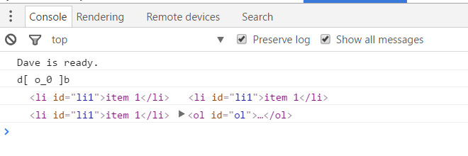

# Preguntas para entrevista de frontend
### JavaScript

### Preguntas
1. [x] [Explica la delegación de eventos](#1)
1. [ ] [Explica cómo funciona `this` en JavaScript](#2)
1. [ ] [Explica cómo funciona la herencia de prototipos](#3)
1. [ ] [¿Qué opiniones tienes de AMD versus CommonJS?](#4)
1. [ ] [¿Porqué este snippet no funciona como una funcion autoejecutable, si tiene el paréntesis al final? ¿Cómo debería ser?](#5)
    ```javascript
    function hola(){
        console.log('mundo');
    }()
    ```

1. [ ] [¿Cuál es la diferencia entre una variable: `null`, `undefined` y no declarada?](#6)
1. [x] [¿Qué es un closure? ¿Cómo y porqué usarías uno? ¿Podrías darme un ejemplo de uso?](#7)
1. [ ] [¿Qué es una función anónima? ¿Dónde usarías una? ¿Cuál es la desventaja de ellas?](#8)
1. [ ] [¿Cuál es la diferencia entre un objeto "host" y un objeto "nativo"?](#9) [Revisa aqui](http://stackoverflow.com/questions/7614317/what-is-the-difference-between-native-objects-and-h)
1. [ ] [¿En qué difieren las siguientes expresiones?](#10)
    ```javascript
    // expresión 1
    function Hola() {}

    // expresión 2
    var hola = new Hola()

    // expresión 3
    var hola = Hola()
    ```

1. [ ] [¿En que se diferencias `Function.call()` y `Function.apply()`?](#11)
1. [ ] [¿Explícame `Function.prototype.bind` ?](#12)
1. [ ] [¿Cuál es la diferencia entre deteccion de features, inferencia de features y usar el string UA?](#13)
1. [ ] [Explícame AJAX.](#14)
1. [ ] [¿Qué ventajas y desventajas tiene el usar AJAX?](#15)
1. [ ] [¿Qué es JSONP?](#16)
1. [ ] [Explícame Hoisting](#17)
1. [ ] [¿Cuáles son las ventajas/desventajas de usar clases en ES6?](#18)
1. [ ] [Describe el 'event bubbling'](#19)
1. [ ] [¿Cuál es la diferencia entre `==` y `===`?](#20)
1. [ ] [Haz que esto funcione](#21)
    ```javascript
    [2,3,5,6].replicate()   // [2,3,5,6,2,3,5,6]
    [2,3,5,6].replicate(1)  // [2,3,5,6,2,3,5,6]
    [2,3,5,6].replicate(2)  // [2,3,5,6,2,3,5,6,2,3,5,6]
    ```

1. [ ] [¿Tienes un ejemplo de una expresión ternaria? ¿Porqué "ternaria"?](#22)
1. [ ] [¿Porqué es generalmente una buena idea no agregar cosas al scope global de un sitio web (window)?](#23)
1. [ ] [¿Porqué usarías el evento "load"? ¿Ventajas y desventajas? ¿Alternativas?](#24)
1. [ ] [¿Cómo harías una SPA (Single page application) "SEO Friendly"?](#25)
1. [ ] [¿Qué ventajas tiene el usar promesas?](#26)
1. [ ] [Además de callbacks, ¿qué otras maneras existen de trabajar con asincronía en JavaScript?](#27)
1. [ ] [Teniendo lo siguiente:](#28)
    ```javascript
    function buscarTextoAsíncronamente(texto, callback) {
      const resultado = funcionQueBuscaTextoEnUnOrigen(texto);
      if (resultado) {
        callback(null, resultado);
      } else {
        callback(error, result)
      }
    }
    ```

    ¿Qué se debería hacer para poder usar la misma funcionalidad pero con promesas?

1. [ ] [¿Porqué debería usar o no usar un lenguaje que transpile o compile a JavaScript? ¿Qué ventajas o desventajas existen?](#29)
1. [ ] [¿Cómo debugueas tu código de JavaScript?](#30)
1. [ ] [¿Cómo puedo iterar sobre un objeto y un array?](#31)
1. [ ] [¿Conoces como funciona `[].map()`?](#32)
  - Crea una función que realice lo mismo pero para objetos. (Que reciba como 1er parámetro un objeto, y como 2do parámetro una función que se ejecutará sobre cada par llave/valor).
  - Cambia la función para que pueda recibir como primer parámetro un Array o un Objeto
  - Puedes replicar `[].map()` en `{}.map()`?
1. [ ] [Explícame la diferencia entre `let`, `const` y `var`.](#33)
1. [ ] [Explícame la diferencia entre síncrono y asíncrono.](#34)
1. [ ] [¿Qué es event loop?](#35)
1. [ ] [¿Cuál es la diferencia entre `call stack` y `task queue`?](#36)
1. [ ] [Además de "porque se ve más bonito" ¿por qué debería usar arrow functions `() => {}`?](#37)
1. [ ] [¿Qué diferencia existe en el uso de `hola` entre estas expresiones?](#39)
    ```javascript
    // expresión 1
    function hola(){}

    // expresión 2
    var hola = function(){}

    // expresión 3
    var hola = () => {}
    ```
1. [ ] [¿Qué es y porqué usar o no Transpiladores? (Babel o buble)](#39)
1. [ ] [¿Qué propuestas de JavaScript es la que más te gustaría/interesa que sea aprobada?](#40)


### Respuestas

1.  [Explica la delegación de eventos:](#1)
    <div id="1" />

    Es una técnica que permite agregar un *controlador de eventos* (EventHandler) en un elemento padre a fin de no tener que agregar multiples *controladores de eventos* en los hijos.

    ***Explicación extensa:***

    La delegación de eventos en JavaScript hace uso de 2 conceptos existentes, el *Burbujeo de Eventos* (Event Bubbling) y el *Elemento Objetivo* (Target Elemento).

    El Burbujeo de eventos es la funcionalidad de que cualquier evento disparado en un elemento, es tambien disparado en los elementos padres del mismo.
    ```html
    <ol id="ol">
      <li id="li1">item 1</li>
      <li id="li2">item 2</li>
    </ol>
    ```
    ```javascript
    document.getElementById('ol').addEventListener('click', () => {
      console.log('ol clickeado')
    })
    document.getElementById('li1').addEventListener('click', () => {
      console.log('li1 clickeado')
    })
    document.getElementById('li2').addEventListener('click', () => {
      console.log('li2 clickeado')
    })
    ```
    Al clickear un elemento 'li', se disparan ambos eventos (li y ol);
    [(Ejemplo en JS Bin)](https://jsbin.com/bewosoyobo/edit?html,js,console,output)

    Podemos comprender el elemento objetivo si cambiamos un poco el código de JS
    ```javascript
    document.getElementById('ol').addEventListener('click', (e) => console.log(e.target, e.currentTarget))
    document.getElementById('li1').addEventListener('click', (e) => console.log(e.target, e.currentTarget))
    document.getElementById('li2').addEventListener('click', (e) => console.log(e.target, e.currentTarget))
    ```
    [(Ejemplo en JS Bin)... abre tu consola de desarrollo para verlo mejor](https://jsbin.com/qizezi/edit?html,js,console,output#H:L10)
    Clickear en `li1` imprime lo siguiente:
    

    Por lo que un evento contiene la propiedad `target` como `currentTarget`.
    `target` es el elemento del cual se disparó el evento, mientras que `currentTarget` es el elemento al cual fue adjuntado el `eventHandler`.
    (Por eso en el primer `console.log` son iguales, y en el segundo distintos).

    Nos podemos aprovechar de esto para realizar delegación de eventos.

    ```html
    <ol id="ol">
      <li id="li1">item 1</li>
      <li id="li2">item 2</li>
      <li id="li3">item 3</li>
      <li id="li4">item 4</li>
      <li id="li5">item 5</li>
      <li id="li6">item 6</li>
    </ol>
    ```
    ```javascript
    document.getElementById('ol').addEventListener('click', (e) => {
      if (e.target.tagName === 'LI' ) {
       console.log('desde: ' + e.target.id);
      }
    })
    ```
    [Ejemplo en JSBin acá](https://jsbin.com/qavexu/2/edit?html,js,console,output)

    En este nuevo ejemplo, necesitamos solo definir un administrar de eventos (Event Handler) para poder realizar acciones con cada uno de los LI.

    A esta técnica se le conoce como "Event Delegation".


1.  [Explica como funciona `this` en JavaScript](#2)
    <div id="2" />
    La palabra reservada `this` hace referencia al contexto de ejecución actual, y en la mayoría de los casos, su valor es determinado dependiendo de como se llamó a la función en que se declaró. Existen una serie de factores que cambian el comportamiento de `this`en javascript
    
    **Modo estricto**
    
    En modo estricto (usando `'use strict'`), el valor de `this` es por defecto `undefined`, esto debido a razones de [performance y seguridad](https://developer.mozilla.org/en-US/docs/Web/JavaScript/Reference/Strict_mode#Securing_JavaScript), aunque el valor de `this` aún puede modificarse usando `bind`, `call` o `apply`. Este no es el caso para el modo no estricto. Por ejemplo
    
    ```js
    function f1(){
        return this;
    }
    // En el browser
    f1() === window; // En modo estricto, esto arroja false   
    ```
    
    **`this` en objetos**
    
    Cuando se usa `this` en el método de un objeto, su valor hace referencia al objeto en que es invocado, **independiente del contexto en que se declara el método**. Por ejemplo,
    
    ```js
    var o = {p: 37};

    function fn() {
      return this.p;
    }

    o.f = fn;

    console.log(o.f()); // 37
    ```
    
    **`bind`, `call` y `apply`**
    
    El valor de `this` puede ser manualmente modificado al momento de ejecutar una función, usando los métodos mencionados. `call` y `apply` funcionan de forma similar, llaman a una función pasando como parametro el valor de `this` de forma explicita
    
    ```js
    function add(c, d){
      return this.a + this.b + c + d;
    }

    var o = {a:1, b:3};
    
    add.call(o, 5, 7); // 1 + 3 + 5 + 7 = 16
    
    add.apply(o, [10, 20]); // 1 + 3 + 10 + 20 = 34
    ```
    
    Por otro lado, bind asigna un valor al `this` de una función de forma permanente a una nueva función
    
    ```js
    var add2 = add.bind({a:1, b:3})
    add2(1, 2) // 1 + 3 + 1 + 2 = 7
    ```
    
    **arrow functions**
    
    Las funciones de flecha asignan el valor de `this` al contexto _'padre'_ del contexto de ejecución, independiente de si son llamadas directamente, o como método de un objeto, tampoco se puede cambiar el valor de `this` con las funciones `bind`, `call` y `apply`.
    
1.  [Explica como funciona la herencia de prototipos](#3)
    <div id="3" />

1.  [¿Qué opiniones tienes de AMD versus CommonJS?](#4)
    <div id="4" />

1.  [Porqué este snippet no funciona como una funcion autoejecutable: `function hola(){console.log('mundo')}()` si tiene el paréntesis al final? ¿Cómo debería ser?](#5)
    <div id="5" />

1.  [¿Cuál es la diferencia entre una variable: `null`, `undefined` y no declarada?](#6)
    <div id="6" />

1.  [¿Qué es un closure? ¿Cómo y porqué usarías uno? ¿Podrías darme un ejemplo de uso?](#7)
    <div id="7" />
    Un closure es una característica que tiene JavaScript de que una función al ejecutarse, recuerde el entorno en la que fue creada.
    Por ejemplo:
    ```javascript
    function bar() {
      var text = 'mundo';
      function foo() {
        console.log('hola ' + text);
      }
      foo();
    }
    bar();
    ```
    Esta funcion imprimirá 'hola mundo', sin ningun problema.

    Ahora, consideremos lo siguiente:
    ```javascript
    var text = 'fforres';
    function bar() {
      var text = 'mundo';
      function foo() {
        console.log('hola ' + text);
      }
      return foo;
    }
    var willItPrint = bar();
    willItPrint();
    ```
    Si bien estamos definiendo en 2 lugares la variable `text`, al momento de definir la función `foo` la variable `text` tiene el valor de 'mundo'.
    La funcion `foo` la estamos devolviendo y guardando en la variable `willItPrint` por lo que independiente de el momento en el que llamemos a la funcion guardada en esa variable, el resultado será:
    "hola mundo";


1.  [¿Qué es una función anónima? ¿Dónde usarías una? ¿Cuál es la desventaja de ellas?](#8)
    <div id="8" />

1.  [¿Cuál es la diferencia entre un objeto "host" y un objeto "nativo"?](#9)
    <div id="9" />
    ```javascript
    // http://stackoverflow.com/questions/7614317/what-is-the-difference-between-native-objects-and-h
    ```
1.  [¿En qué difieren las siguientes expresiones `function Hola() {}`, `var hola = new Hola()` y `var hola = Hola()`?](#10)
    <div id="10" />

1.  [¿En que se diferencias `Function.call()` y `Function.apply()`?](#11)
    <div id="11" />

1.  [¿Explícame `Function.prototype.bind` ?](#12)
    <div id="12" />

1.  [¿Cuál es la diferencia entre deteccion de features, inferencia de features y usar el string UA?](#13)
    <div id="13" />

1.  [¿Explícame AJAX?](#14)
    <div id="14" />

1.  [¿Qué ventajas y desventajas tiene el usar AJAX?](#15)
    <div id="15" />

1.  [¿Qué es JSONP?](#16)
    <div id="16" />

1.  [¿Explícame Hoisting?](#17)
    <div id="17" />

1.  [¿Cuáles son las ventajas/desventajas de usar clases en ES6?](#18)
    <div id="18" />

1.  [¿Describe el 'event bubbling'?](#19)
    <div id="19" />

1.  [¿Cuál es la diferencia entre `==` y `===`?](#20)
    <div id="20" />

1.  [Has que esto funcione:](#21)
    <div id="21" />
    ```javascript
    [2,3,5,6].replicate()   // [2,3,5,6,2,3,5,6]
    [2,3,5,6].replicate(1)  // [2,3,5,6,2,3,5,6]
    [2,3,5,6].replicate(2)  // [2,3,5,6,2,3,5,6,2,3,5,6]
    ```

1.  [¿Tienes un ejemplo de una expresión ternaria? ¿Porqué "ternaria"?](#22)
    <div id="22" />

1.  [¿Porqué es generalmente una buena idea no agregar cosas a scope global de un sitio web? (window) ?](#23)
    <div id="23" />

1.  [¿Porqué usarías el evento "load"? ¿Ventajas y desventajas? ¿Alternativas?](#24)
    <div id="24" />

1.  [¿Cómo harías una SPA (Single page application) "SEO Friendly"?](#25)
    <div id="25" />

1.  [¿Qué ventajas tiene el usar promesas?](#26)
    <div id="26" />

1.  [Además de callbacks. ¿Qué otras maneras existen de trabajar con asincronía en JavaScript?](#27)
    <div id="27" />

1.  [Teniendo lo siguiente:](#28)
    <div id="28" />
    ```javascript
    function buscarTextoAsíncronamente(texto, callback) {
      const resultado = funcionQueBuscaTextoEnUnOrigen(texto);
      if (resultado) {
        callback(null, resultado);
      } else {
        callback(error, result)
      }
    }
    ```

    Que debería hacer para poder usar la misma funcionalidad pero con promesas?

1.  [¿Porqué debería usar o no usar un lenguaje que transpile o compile a JavaScript? ¿Qué ventajas o desventajas existen?](#29)
    <div id="29" />

1.  [¿Cómo debugueas tu código de JavaScript?](#30)
    <div id="30" />

1.  [¿Cómo puedo iterar sobre un objeto y un array?](#31)
    <div id="31" />

1.  [¿Conoces como funciona `[].map()`?](#32)
    <div id="32" />
    - Crea una función que realice lo mismo pero para objetos. (Que reciba como 1er parámetro un objeto, y como 2do parametro una función que se ejecutará sobre cada par llave/valor).
    - Cambia la función para que pueda recibir como primer parámetro un Array o un Objeto
    - Puedes replicar `[].map()` en `{}.map()`?

1.  [Explícame la diferencia entre `let`, `const` y `var`.](#33)
    <div id="33" />

1.  [Explícame la diferencia entre síncrono y asíncrono.](#34)
    <div id="34" />

1.  [¿Qué es event loop?](#35)
    <div id="35" />

1.  [¿Cuál es la diferencia entre `call stack` y `task queue`?](#36)
    <div id="36" />

1.  [Además de "porque se ve más bonito" ¿Por qué debería usar arrow functions `() => {}`?](#37)
    <div id="37" />

1.  [Qué diferencia existe en el uso de `hola` entre `function hola(){}`, `var hola = function(){}` y `var hola = ()=>{}`](#39)
    <div id="39" />

1.  [¿Qué es y Porqué usar o no Transpiladores (Babel, o buble)?](#39)
    <div id="39" />

1.  [¿Qué proposals de JavaScript es la que más te gustaría/interesa que sea aprobada?](#40)
    <div id="40" />
